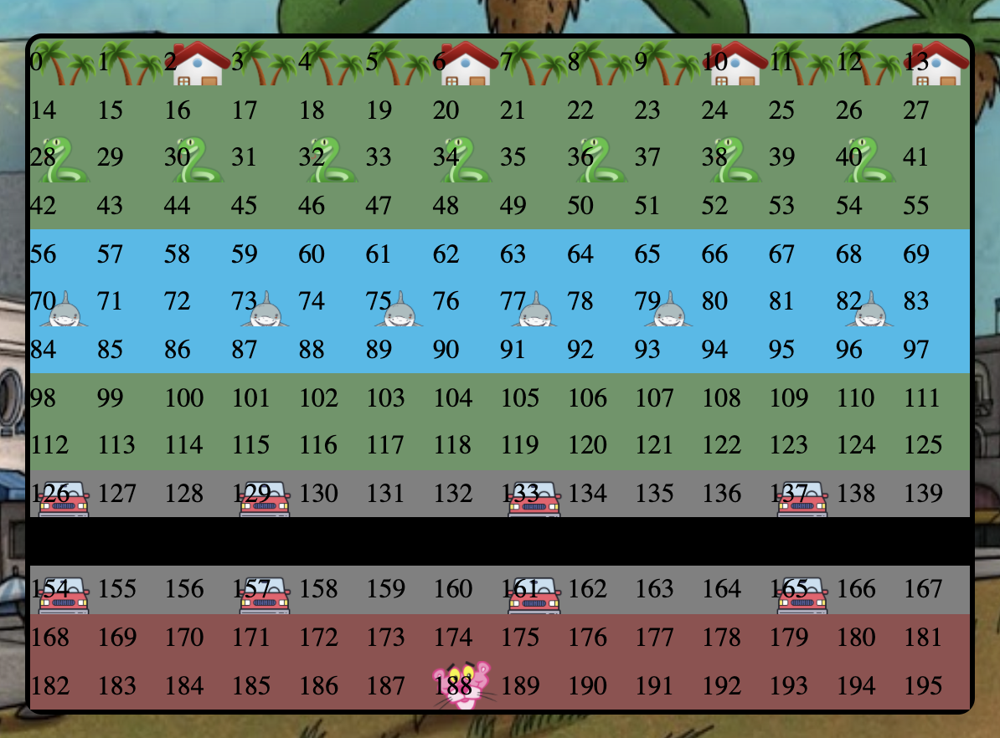

###  General Assembly, Software Engineering Immersive
# Frogger

## Overview

This is my first project of the software engineering immersive course at GA London. The assignment was to create a grid-based game to be rendered in the browser, using HTML, CSS and JavaScript. The project was to be completed **individually** within **one week**.

Given a list of options from GA, I chose to re-create the classic game **Frogger**. Please note that while the game is designed in a pink panther theme, this documentation is written in terms of the original Frogger lingo, e.g. moving obstacles, as the underlying code. 

You can launch the game on GitHub pages [here](https://lucymait.github.io/project-1/)

## How to play

- Use ← ↑ → ↓ arrow keys to move the player
- Avoid moving obstacles 
- Get each panther home to collect points!
- Win by getting all 4 panthers home

## Brief

- **Render a game in the browser**
- **Design logic for winning & visually display scoreboard**
- **Include separate HTML / CSS / JavaScript files**
- Stick with **KISS (Keep It Simple Stupid)** and **DRY (Don't Repeat Yourself)** principles
- Use **Javascript** for **DOM manipulation**
- **Deploy the game online**, where the rest of the world can access it
- Use **semantic markup** for HTML and CSS (adhere to best practices)

## Technologies Used

- HTML
- HTML
- CSS
- JavaScript (ES6)
- Git and GitHub
- Google Fonts
- freesound

## Approach

### The Grid

The game is built using a grid. A 14 x 14 square is created using JavaScript. Next, I set my value of my panther to be 188. This is the ID of the cell I wanted my frog to start at.
 ```js
  const width = 14
  const gridCellCount = width * width
  const grid = document.querySelector('.grid')
  const cells = []
  let panther1 = 188
  ```
HTML divs are created using a for loop and appended as children of the grid. ClassList was used to add all the image icons to the grid, e.g. panther, cars, sharks, snakes, palm trees and houses.

  ```js
    for (let i = 0; i < gridCellCount; i++) {
    const cell = document.createElement('div')
    cell.classList.add('cell')
    cell.innerHTML = i
    if (i === panther1) {
      cell.classList.add('panther1')
    }
    if (cars1Array.includes(i)) {
      cell.classList.add('car')
    }
    if (cars2Array.includes(i)) {
      cell.classList.add('car')
    }
    if (sharksArray.includes(i)) {
      cell.classList.add('shark')
    }
    if (snakesArray.includes(i)) {
      cell.classList.add('snake')
    }
    if (housesArray.includes(i)) {
      cell.classList.add('house')
    }
    if (roadArray.includes(i)) {
      cell.classList.add('road')
    }
    if (roadMarkerArray.includes(i)) {
      cell.classList.add('roadMarker')
    }
    if (waterArray.includes(i)) {
      cell.classList.add('water')
    }
    if (pavementArray.includes(i)) {
      cell.classList.add('pavement')
    }
    if (palmtreeArray.includes(i)) {
      cell.classList.add('palmtree')
    }
    cells.push(cell)
    grid.appendChild(cell)
  }
 ```
 During actual gameplay, the grid isn't visible, but it is highlighed below for demonstration purposes:
 
 

 

### Objects movement 

A set interval was used, with a for loop, to move each array of objects. Once the objects reached the end of each row, **classlist.remove** was used to remove the array and then **classlist.add** added the array back to the start of the row.

```js
  const firstIntervalId = setInterval(() => {
      for (let i = 0; i < cars1Array.length; i++) {
        if (cars1Array[i] === 139) {
          cells[cars1Array[i]].classList.remove('car')
          cars1Array[i] = 125
          cells[cars1Array[i]].classList.add('car')
        }
        cells[cars1Array[i]].classList.remove('car')
        cars1Array[i]++
        cells[cars1Array[i]].classList.add('car')
      }
      for (let i = 0; i < cars2Array.length; i++) {
        if (cars2Array[i] === 167) {
          cells[cars2Array[i]].classList.remove('car')
          cars2Array[i] = 153
          cells[cars2Array[i]].classList.add('car')
        }
        cells[cars2Array[i]].classList.remove('car')
        cars2Array[i]++
        cells[cars2Array[i]].classList.add('car')
      }
      for (let i = 0; i < sharksArray.length; i++) {
        if (sharksArray[i] === 83) {
          cells[sharksArray[i]].classList.remove('shark')
          sharksArray[i] = 69
          cells[sharksArray[i]].classList.add('shark')
        }
        cells[sharksArray[i]].classList.remove('shark')
        sharksArray[i]++
        cells[sharksArray[i]].classList.add('shark')
      }
      for (let i = 0; i < snakesArray.length; i++) {
        if (snakesArray[i] === 41) {
          cells[snakesArray[i]].classList.remove('snake')
          snakesArray[i] = 27
          cells[snakesArray[i]].classList.add('snake')
        }
        cells[snakesArray[i]].classList.remove('snake')
        snakesArray[i]++
        cells[snakesArray[i]].classList.add('snake')
      }
    }, 350)
```

### Game timing 

A ```let``` was used in our app.js to start our counter at 30 (seconds).

Next, a setInterval was used to add a reduce the counter every second. Another, if statement was used to turn the id 'screen' to red when the counter drops below 5. 

When the counter reaches 0, all the intervals are cleared, the gameover sound is played and the pop up box is displayed. Similar to the collission, the displayScore function is called, whereby the player can enter their score and/or choose to play again. This score is stored in localStorage.

```js
const secondIntervalId = setInterval(() => {
      timerscreen.innerHTML = counter
      if (counter <= 5) {
        document.getElementById('screen').style.backgroundColor = 'red'
      }
      if (counter === 0) {
        clearInterval(collissionIntervalId)
        clearInterval(firstIntervalId)
        clearInterval(secondIntervalId)
        audio2.play()
        gameover.style.display = 'block'
        setTimeout(() => {
          gameover.style.display = 'none'
          endScore.style.display = 'block'
          endScore.innerHTML = `SCORE = ${score}`
          leaderboard.style.display = 'block'
        }, 5000)
        setTimeout(() => {
          displayScore()
        }, 5000)
        setTimeout(() => {
          play = confirm(`Your score is ${score}. Do you want to play again? `)
          if (play === true) {
            clearInterval(collissionIntervalId)
            window.location.reload()
          }
        }, 10500)

      } else {
        counter -= 1
      }
    }, 1000)
```

### Collisions 

I used a collission function to remove a life if the panther was in the same cell as either the cars array (cells containing a car), the snakes array (cells containing a snake), a sharks array (containing a shark) or a palm tree array (cell containing a palm tree). If the panther is in the same cell as any of the arrays, then the function:

1. Removes a life
2. Renders it in the innerHTML
3. Removes the panther from that cell
4. Adds the panther back to the starting cell (188)

```js
function collission() {
if (cars1Array.includes(panther1) || cars2Array.includes(panther1) || snakesArray.includes(panther1) || sharksArray.includes(panther1) || palmtreeArray.includes(panther1)) {
        lives -= 1
        playerLives.innerHTML = `Lives: ${lives}`
        cells[panther1].classList.remove('panther1')
        audio3.play()
        panther1 = 188
        cells[panther1].classList.add('panther1')
}
```

### Gameover screen

When the lives were less than 1. I returned an Element object representing the element whose id property matches the specified string ('playerLives') and turned the background of that id red so that the player is aware they only have 1 life left!

```js
 if (lives <= 1) {
          document.getElementById('playerLives').style.backgroundColor = 'red'
        } 
```

Once the player reaches 0 lives, I cleared the 3 set intervals, played the gameover sound and displayed the GAMEOVER text. The score was then displayed, which I added a setTimeout on, of 5 seconds. 

Next the Display Score Function was called, where the player can enter their score (which was stored in local storage) and then can choose whether they want to play again. If they choose to play again, an if statement was used to clearInterval and reload the page.

```js
else if (lives === 0) {
        clearInterval(collissionIntervalId)
        clearInterval(firstIntervalId)
        clearInterval(secondIntervalId)
        audio2.play()
        gameover.style.display = 'block'
        setTimeout(() => {
          gameover.style.display = 'none'
          endScore.style.display = 'block'
          endScore.innerHTML = `SCORE = ${score}`
          leaderboard.style.display = 'block'
        }, 5000)
        setTimeout(() => {
          displayScore()
        }, 5000)
        setTimeout(() => {
          play = confirm(`Your score is ${score}. Do you want to play again? `)
          if (play === true) {
            clearInterval(collissionIntervalId)
            window.location.reload()
          }
        }, 9000)
      }
```


### Victory screen

Not only did the game detect lives lost, but it also had a scoring system. When the panther reached one of the houses, 100 points was added to the score. If the panther got to 400 points (and entered 4 houses), then all the intervals are cleared, the victory sound is played and the players score is revealed. 

Similar to GAMEOVER, the displayScore function is called, where the player can enter their score and be added to the leaderboard (which is stored in local storage). The player can choose to play again, once they have entered their score. 

```js
 if (score >= 400) {
          clearInterval(collissionIntervalId)
          clearInterval(firstIntervalId)
          clearInterval(secondIntervalId)
          audio4.play()
          wingame.style.display = 'block'
          setTimeout(() => {
            wingame.style.display = 'none'
            endScore.style.display = 'block'
            endScore.innerHTML = `SCORE = ${score}`
            leaderboard.style.display = 'block'
          }, 5000)
          setTimeout(() => {
            displayScore()
          }, 5000)
          setTimeout(() => {
            play = confirm(`Your score is ${score}. Do you want to play again? `)
            if (play === true) {
              clearInterval(collissionIntervalId)
              window.location.reload()
            }
          }, 9000)
          return
        }
```

### Local Storage

Local Storage was used to store the players score. 

The displayScore function (as mentioned above) contained an if statement which used localStorage to get the score from the string ('players'). 
```js  
 function displayScore() {
    let scores = []
    const scoresList = document.querySelector('ol')
    const scoreButton = document.querySelector('#score-enter')
  
    if (localStorage) {
      const players = JSON.parse(localStorage.getItem('players'))
      if (players) {
        scores = players
        renderList(scores, scoresList)
      }
    }
  ```

  An EventListener was used for when the player entered their name and score. This new object was then pushed using **socres.push(player)** and then displaed in the renderList. Local storage was then used to setItem, which saved the new score for that specific player.

  ```js  
    scoreButton.addEventListener('click', () => {
      console.log(scores)
      const newName = prompt('Enter your name?')
      const newScore = prompt('What was your score?')
      const player = { name: newName, score: newScore }
      scores.push(player)
      renderList(scores, scoresList)
      if (localStorage) {
        localStorage.setItem('players', JSON.stringify(scores))
      }
    })

  }
  ```
  The renderList function was used to sort the scores in order by mapping through them and then display the players name and score. 

  ```js  
  function renderList(scores, scoresList) {
    const array = scores.sort((playerA, playerB) => playerB.score - playerA.score).map(player => {
      return `<li>
        ${player.name} = <strong>${player.score} points</strong>.
      </li>`
    })
    scoresList.innerHTML = array.join('')
  }
  ```

## Sounds

Sounds were added to give the user a proper experience when playing the game: 
1. A Pink Panther theme tune ran in the background throughout the game

2. Click sound played when the ← ↑ → ↓ arrow keys were used
  ```html
  <audio id="click" src="sounds/click.wav"></audio>  
  ```
3. Door closing sound played when the panther entered the house
  ```html
  <audio id="door" src="sounds/door.wav"></audio>
  ```
4. Life loss sound played when the panther lost a life
  ```html
 <audio id="life" src="sounds/lifeloss.wav"></audio>
  ```
5. Gameover sound played when the panther lost 3 lives
  ```html
  <audio id="gameover" src="sounds/gameover.wav"></audio>
  ```
6. Finally, the victory sound played when you win
  ```html
  <audio id="victory" src="sounds/youwin.mp3"></audio>
  ```

## Screenshots


## Potential future features
- Levels of difficulty
- Option in the beginning for the player to choose different characters
- More & better sounds
- Making it mobile friendly

## Biggest Challenge & Wins 
- My biggest challenge was the Gameover section, as I had to clear interval then display the player's final score and finally allow the player to enter their score to the leaderboard. I managed to solve this problem by using local storage to store the players score.

## Lessons learned
- Design mobile first.
- Make sure to create a detailed plan at the start to minimize back and forth and having to reconfigure your code. 